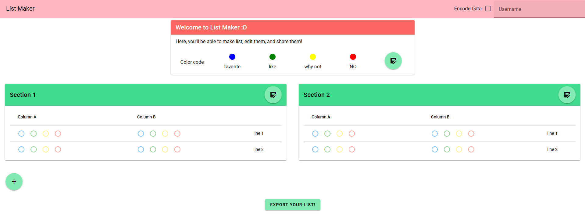

# listmaker v3
[](https://github.com/Pholith/list-maker/actions/workflows/node%20workflow.yml)




## Project setup
```
npm install
```

### Compiles and hot-reloads for development
```
npm run dev
```

### Compiles and minifies for production
```
npm run build
```

### Customize configuration
See [Configuration Reference](https://cli.vuejs.org/config/).
